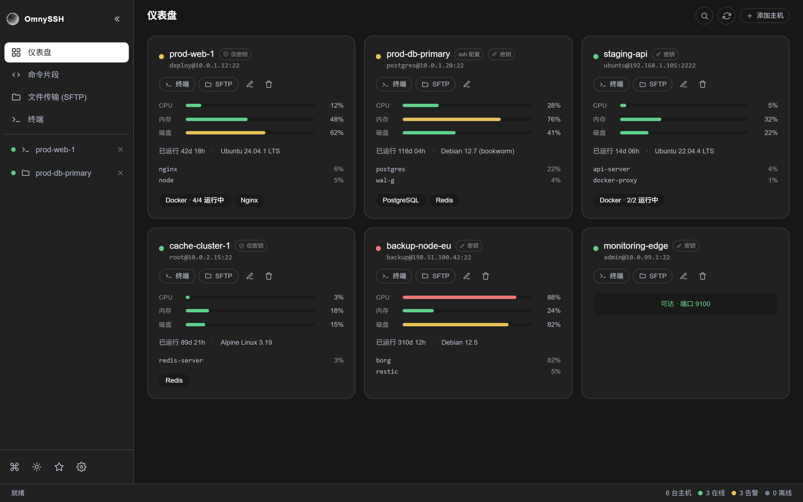

# OmnySSH 简体中文版

### 现代化 TUI / GUI SSH 服务器管理工具 —— 仪表盘、终端、SFTP、命令片段全集成

---

## 项目简介

**OmnySSH 简体中文版** 是基于官方上游 [timhartmann7/omnyssh](https://github.com/timhartmann7/omnyssh) 深度定制的中文本地化分支。

本项目引入了轻量级、无侵入的 **多语言国际化（i18n）架构**，内置全套简体中文（zh-CN）语言包，并配置了 **GitHub Actions 每日自动同步官方上游代码** 的自动化流水线，保持官方最新特性的同时享受舒适的中文界面。

---

## 主要功能特性

- **实时服务器仪表盘**：单个窗口统一监控多台 VPS/服务器，直观展示 CPU、内存、磁盘使用率进度条、运行时间、操作系统及 Docker 等服务运行状态。
- **内置多标签终端 (PTY)**：基于 xterm 的高性能全功能终端，支持分屏会话与后台无缝切换。
- **双栏式 SFTP 文件传输**：左侧本地、右侧远程，支持批量上传、下载、新建目录、文件重命名与文件快速预览，告别繁琐的 `scp` 命令。
- **命令片段与多机广播**：保存高频 Shell 运维命令，支持动态参数插值（`{{service}}`），并支持一键向选中的多台服务器并发广播执行。
- **自动化 SSH 密钥免密配置**：一键生成 Ed25519 密钥、分发公钥、验证连接并安全禁用密码认证，全自动回滚机制保障服务器安全。
- **⌘K 全局快速命令面板**：键盘驱动，快速搜索与切换主机和活动会话。
- **主播/隐私模式 (Streamer Mode)**：一键对界面中所有敏感主机名与 IP 地址进行安全脱敏，适合录屏与直播演示。
- **多语言随时切换**：在“设置 (Settings)”中可随时自由切换 **简体中文** 与 **English**。

---

## 安装与使用

### GUI 桌面客户端

前往 [**Releases 发行版页面**](https://github.com/AnonyJcy/omnyssh-cn/releases) 下载对应平台的安装包：

| 操作系统平台 | 文件格式 | 说明 |
|-------------|----------|------|
| **Windows x86_64** | `OmnySSH-x86_64-setup.exe` / `.zip` | 适用于 64 位 Windows 系统（安装版 / 便携版） |
| **macOS (Apple Silicon)** | `OmnySSH-aarch64-apple-darwin.dmg` | 适用于 M1/M2/M3/M4 系列芯片 |
| **macOS (Intel)** | `OmnySSH-x86_64-apple-darwin.dmg` | 适用于 Intel 处理器 Mac |
| **Linux x86_64** | `OmnySSH-x86_64.AppImage` / `.deb` / `.rpm` | 通用 Linux 发行版 |

> **无账号、无遥测、无数据上传**：应用本地运行，自动读取你的 `~/.ssh/config` 配置，隐私安全。

---

## 自动化同步与维护

本项目通过 GitHub Actions 实现了与官方上游仓库的自动化跟踪：
1. **每日定时同步**：北京时间每天 10:00 自动检查并合并官方 `main` 分支的最新提交。
2. **语言包彻底隔离**：翻译字典独立存放在 `$lib/i18n/locales/`，合并上游核心业务代码时极低冲突率。

---

## 致敬原作者与开源协议

- **官方上游仓库**：[timhartmann7/omnyssh](https://github.com/timhartmann7/omnyssh)
- **开源协议**：[Apache License 2.0](LICENSE)
- 感谢原作者 **Tim Hartmann**（[@timhartmann7](https://github.com/timhartmann7)）打造的开源工具。
